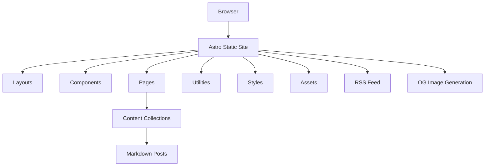
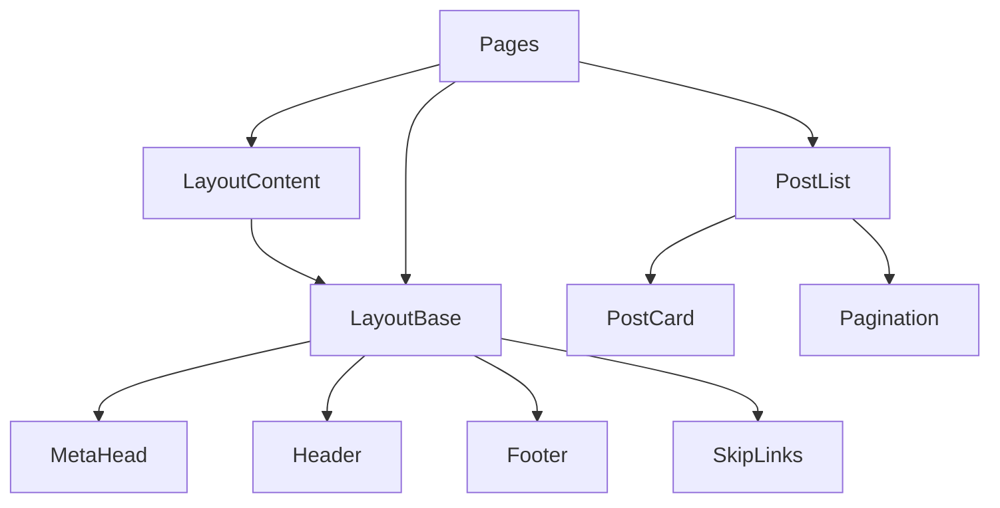

# Untitled Sheep Project Overview

## Executive Summary

Untitled Sheep (*Безымянная овца) is a Russian-language blog built with Astro.js. It's a static site that renders blog posts from Markdown files using Astro's content collections. The project features multiple post types (regular, photo, link, etc.), tag-based navigation, RSS feed, and dynamic OG image generation. It's currently under active development with several planned features in the roadmap.

## Project Purpose & Architecture

### Purpose

Untitled Sheep is a personal blog platform designed to display various types of content including regular posts, photos, links, quotes, and more. The site is primarily in Russian and focuses on providing a clean, fast reading experience with minimal JavaScript.

### Tech Stack

- **Framework**: Astro.js v3
- **Node.js**: v18.14.1 or newer
- **npm**: v8 (comes with Node 18)
- **CSS**: Custom CSS (no styling libraries)
- **Content**: Markdown files via Astro Content Collections
- **Image Optimization**: Built-in Astro image optimization
- **Deployment**: Configured for Vercel

### Architecture Diagram



The architecture follows Astro's component-based approach, with clear separation between layouts, components, and pages. Content is managed through Astro's content collections, which provide type safety and schema validation for blog posts.

## Directory Structure & Organization

```
/
├── public/               # Static assets served as-is
│   ├── rss/              # RSS feed styling
│   ├── fonts/            # Web fonts
│   ├── favicon.png       # Site favicon
│   └── robots.txt        # SEO robots file
├── src/                  # Source code
│   ├── assets/           # Optimized assets (images)
│   │   └── media/        # Blog post images
│   ├── components/       # Reusable UI components
│   ├── content/          # Content collections
│   │   └── blog/         # Blog posts in Markdown
│   ├── layouts/          # Page layouts
│   ├── og-templates/     # OG image generation templates
│   ├── pages/            # Page routes
│   │   ├── archive/      # Archive pages
│   │   ├── post/         # Individual post pages
│   │   └── tagged/       # Tag-filtered pages
│   ├── styles/           # CSS styles
│   ├── utils/            # Utility functions
│   └── config.ts         # Site configuration
└── package.json          # Project dependencies and scripts
```

### Quick Reference Guide

- **Blog posts**: Located in `src/content/blog/`
- **Site configuration**: `src/config.ts`
- **Post schema**: `src/content/config.ts`
- **Page templates**: `src/layouts/`
- **UI components**: `src/components/`
- **Styling**: `src/styles/`
- **Utility functions**: `src/utils/`
- **Static assets**: `public/`
- **Image assets**: `src/assets/`

## Content Management

### Blog Post Structure

Blog posts are stored as Markdown files in the `src/content/blog/` directory. Each post has a frontmatter section with metadata and a content section with the actual post content.

### Post Schema

The blog post schema is defined in `src/content/config.ts` and includes the following fields:

```typescript
{
    isDraft: boolean;           // If true, post won't be published
    id: number;                 // Unique post identifier
    form: enum;                 // Post type (regular, link, quote, photo, etc.)
    title: string | null;       // Post title (optional)
    tags: array;                // Array of tags (optional)
    date: date;                 // Publication date
    tumblr: string | null;      // Tumblr reference (optional)
    photo_original_url: string; // Original photo URL (optional)
    photo: image;               // Post image (optional)
    photo_caption: string;      // Photo caption (optional)
    photo_source: string;       // Photo source (optional)
    photo_source_url: string;   // Photo source URL (optional)
    photo_source_title: string; // Photo source title (optional)
    linkurl: string;            // URL for link posts (optional)
}
```

### Post Types

The blog supports multiple post types:
- `regular`: Standard blog post
- `link`: Link to external content
- `quote`: Quote post
- `photo`: Single photo post
- `photogallery`: Multiple photo post
- `video`: Video post
- `audio`: Audio post
- `chat`: Chat/conversation post

### Content Workflow

1. **Creation**: Create a new Markdown file in `src/content/blog/` with a unique filename
2. **Metadata**: Add required frontmatter fields (id, form, date)
3. **Content**: Write post content in Markdown
4. **Validation**: Content is validated against the schema during build
5. **Publication**: Posts are published if they're not drafts and their date is not in the future
6. **Display**: Posts appear in archives, tag pages, and can be featured on the homepage

## Key Components & Templates

### Layouts

- **LayoutBase.astro**: Base layout with HTML structure, meta tags, and common elements
- **LayoutContent.astro**: Content-specific layout extending the base layout

### Main Components

- **Header.astro**: Site navigation and title
- **Footer.astro**: Site footer
- **PostCard.astro**: Card component for displaying post previews
- **PostList.astro**: List of post cards with pagination
- **Pagination.astro**: Pagination controls
- **MetaHead.astro**: Meta tags for SEO and social sharing
- **SkipLinks.astro**: Accessibility skip links

### Component Relationships



### Page Templates and Routing

- **index.astro**: Homepage showing a random featured post
- **post.astro**: Template for individual blog posts
- **archive/[page].astro**: Paginated archive of all posts
- **tagged/[tag]/[page].astro**: Posts filtered by tag
- **tagcloud.astro**: Tag cloud showing all available tags
- **404.astro**: Custom 404 error page
- **rss.xml.ts**: RSS feed generation

## Utility Functions

### Core Utilities

- **getFeaturedPosts.ts**: Returns a curated list of posts for the homepage
- **getPublishedPosts.ts**: Returns all published posts (not drafts, not future-dated)
- **getSortedPosts.ts**: Returns posts sorted by date
- **getPostsByTag.ts**: Returns posts filtered by a specific tag
- **getUniqueTags.ts**: Returns a list of all unique tags used in posts
- **slugify.js**: Converts strings to URL-friendly slugs
- **dateFormating.js**: Formats dates for display
- **showMenuActiveLink.js**: Highlights the current page in the navigation menu

### Common Usage Patterns

```typescript
// Getting posts for a page
import getPublishedPosts from "@/utils/getPublishedPosts";
const allPosts = await getPublishedPosts();

// Getting posts by tag
import getPostsByTag from "@/utils/getPostsByTag";
const taggedPosts = await getPostsByTag("some-tag");

// Formatting dates
import { getFormattedDate } from "@/utils/dateFormating";
const formattedDate = getFormattedDate(post.data.date);

// Creating URL-friendly slugs
import { slugify } from "@/utils/slugify";
const tagSlug = slugify(tag);
```

## Build & Deployment

### Available Commands

| Command                | Action                                            |
| :--------------------- | :------------------------------------------------ |
| `npm install`          | Installs dependencies                             |
| `npm run dev`          | Starts local dev server at `localhost:4321`       |
| `npm run dev:host`     | Starts local dev server in local network (mobile) |
| `npm run check`        | Run Astro checks                                  |
| `npm run test`         | Run linting and Astro checks before build         |
| `npm run build`        | Build your production site to `./dist/`           |
| `npm run preview`      | Preview your build locally, before deploying      |
| `npm run astro ...`    | Run CLI commands like `astro add`, `astro check`  |

### Development Workflow

1. Before starting a new development server, check if an instance is already running to avoid port conflicts.
2. Run `npm run dev` to start the development server.
3. Make changes to files in the `src/` directory.
4. The development server will automatically reload with your changes.
5. Use `npm run test` to check for linting errors before committing.

### Production Build Process

1. Run `npm run test` to ensure all checks pass
2. Run `npm run build` to generate the production build
3. The built site will be in the `./dist/` directory
4. Preview the build with `npm run preview`
5. Deploy the `./dist/` directory to your hosting provider

### Environment-Specific Configurations

The project is configured for deployment on Vercel, as indicated by the `@astrojs/vercel` dependency in `package.json`. It also supports Node.js server-side rendering via `@astrojs/node`.

## Troubleshooting Guide

### Common Issues

1. **Missing dependencies**: Run `npm install` to ensure all dependencies are installed
2. **Build errors**: Check for linting errors with `npm run test`
3. **Content validation errors**: Ensure blog post frontmatter matches the schema in `src/content/config.ts`
4. **Image optimization issues**: Ensure images are in supported formats (jpg, png, gif)

### Debugging Strategies

1. Check the terminal output for error messages
2. Use the browser developer tools to inspect network requests and JavaScript errors
3. For content issues, validate your Markdown files against the schema
4. For styling issues, check the CSS in the browser inspector

### Performance Optimization

1. Images are automatically optimized by Astro
2. CSS is minified in production builds
3. The site uses static generation for fast page loads
4. Custom fonts are self-hosted for better performance

## Planned Features & TODOs

From the README.md, the following features are planned:

- [ ] Fix Twitter posts that were in Tumblr but are missing
- [ ] Add Content Security Policy for posts with tweets and YouTube iframes
- [ ] Implement form handling for the "Ask a Question" page
- [ ] Fix dynamic OG image generation on Vercel hosting
- [ ] Add dark theme with theme switcher
- [ ] Add microdata markup for posts
- [ ] Implement search functionality (PageFind or FuseJS)
- [ ] Add typography improvements
- [ ] Add ARIA labels for better accessibility
- [ ] Switch from Image component to Picture component
- [ ] Add analytics counters with Partytown

## Quick Start

### Getting Started

1. Ensure you have Node.js v18.14.1 or newer installed
2. Clone the repository: `git clone https://github.com/urbansheep/untitledsheep-astro.git`
3. Install dependencies: `npm install`
4. Start the development server: `npm run dev`
5. Open your browser to `http://localhost:4321`

### Essential Commands for Common Tasks

- **Create a new blog post**: Add a new Markdown file to `src/content/blog/`
- **Add a new component**: Create a new `.astro` file in `src/components/`
- **Add a new page**: Create a new `.astro` file in `src/pages/`
- **Add a new utility**: Create a new `.js` or `.ts` file in `src/utils/`
- **Add a new style**: Modify or create CSS files in `src/styles/`

### Documentation Resources

- [Astro Documentation](https://docs.astro.build/)
- [Astro Content Collections](https://docs.astro.build/en/guides/content-collections/)
- [Markdown Guide](https://www.markdownguide.org/)

## Project Health

### Current Status

- **Tests**: Linting and Astro checks are implemented
- **Linting**: ESLint for JavaScript, Stylelint for CSS, EditorConfig for consistency
- **Type Safety**: TypeScript is used for type checking

### Browser Compatibility

The site should work in all modern browsers. Specific compatibility testing information is not available.

### Git Repository

The project is hosted on GitHub at `https://github.com/urbansheep/untitledsheep-astro.git`. When making changes, follow these guidelines:

1. Create descriptive commit messages that explain the purpose of the change
2. Reference issue numbers in commit messages when applicable
3. Keep commits focused on a single logical change
4. Review changes before committing to ensure they meet project standards

To review the project's history and understand its evolution, use:
- `git log` to see the commit history
- `git log --follow [file]` to see the history of a specific file
- `git blame [file]` to see who last modified each line of a file
